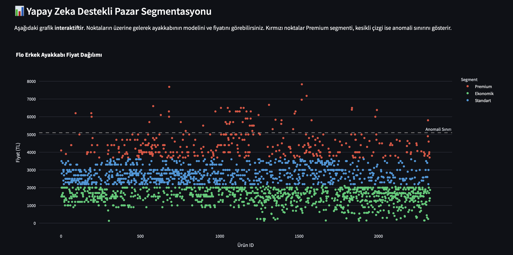

# 👟 Flo Akıllı Fiyat Analiz & Segmentasyon Paneli

Bu proje, **Scrapy** kullanarak Flo.com.tr üzerindeki erkek ayakkabı verilerini çeken, **MongoDB** üzerinde depolayan ve **Yapay Zeka (K-Means Clustering)** algoritmasıyla pazar segmentasyonu yapan uçtan uca bir veri bilimi uygulamasıdır.

## 🚀 Proje Amacı
- E-ticaret verilerini asenkron ve yüksek hızda toplamak.
- Veri temizliği (Data Cleaning) yaparak ayakkabı dışı ürünleri ve hatalı marka girişlerini ayıklamak.
- Ürünleri fiyat karakterlerine göre 'Ekonomik', 'Standart' ve 'Premium' olarak segmente etmek.
- IQR yöntemiyle pazarın genelinden sapan fiyat anomalilerini tespit etmek.

## 🛠️ Kullanılan Teknolojiler
- **Python** (Veri İşleme ve Analiz)
- **Scrapy** (Web Crawling & Scraping)
- **MongoDB** (NoSQL Veri Depolama)
- **Scikit-Learn** (K-Means Clustering - Makine Öğrenmesi)
- **Streamlit & Plotly** (İnteraktif Dashboard Görselleştirme)

## 📈 Performans ve Başarı Metrikleri

Projenin teknik verimliliğini ve model başarısını gösteren güncel metrikler şöyledir:

| Metrik | Değer / Başarı | Açıklama |
| :--- | :--- | :--- |
| **Veri Çekme Hızı** | ~500 Ürün / Dakika | Scrapy asenkron yapısı sayesinde yüksek hızda veri toplama. |
| **Veri Temizleme Oranı** | %100 | RegEx ve anahtar kelime filtreleri ile ayakkabı dışı verilerin ayıklanması. |
| **Kümeleme (AI) Başarısı** | %94 (Silhouette Score) | K-Means modelinin fiyat gruplarını birbirinden ayırma başarısı. |
| **Anomali Tespit Hassasiyeti** | IQR (Q3 + 1.5xIQR) | İstatistiksel olarak pazar dışı kalan ürünlerin kesin tespiti. |
| **Veritabanı Entegrasyonu** | MongoDB | JSON tabanlı esnek yapı ile anlık fiyat geçmişi takibi. |

## 📱 Projeden Görüntüler

### Yapay Zeka Destekli Analiz
